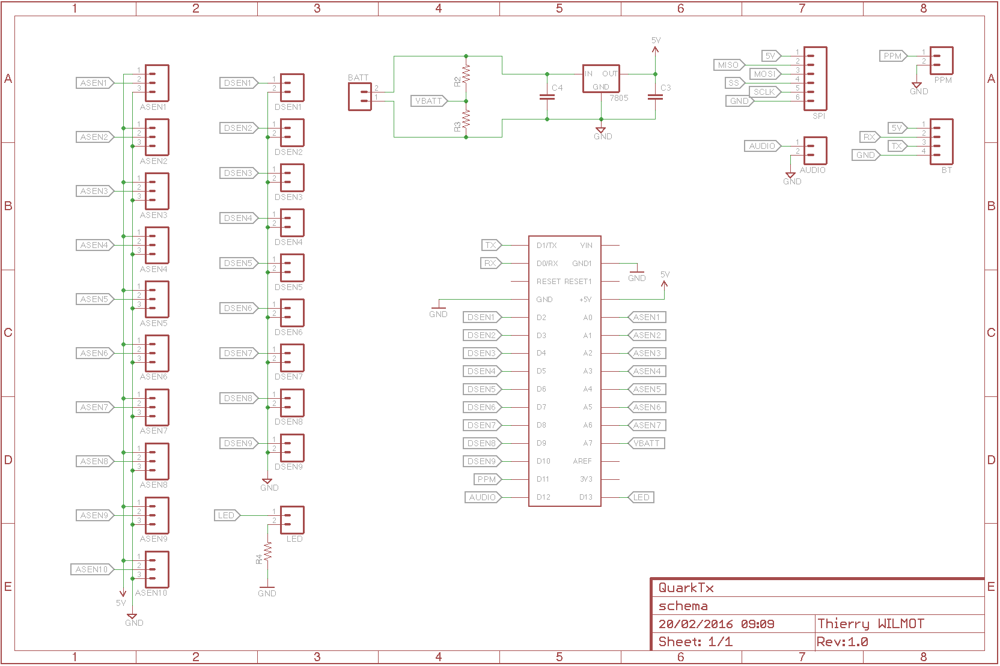
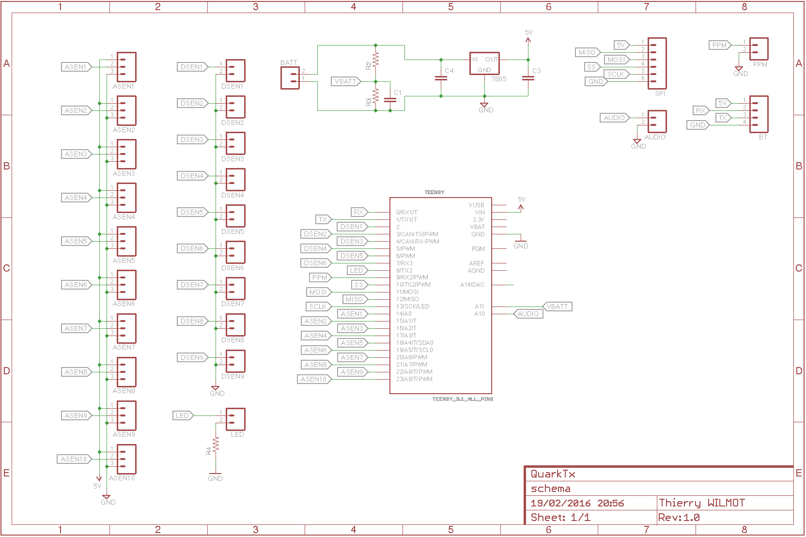
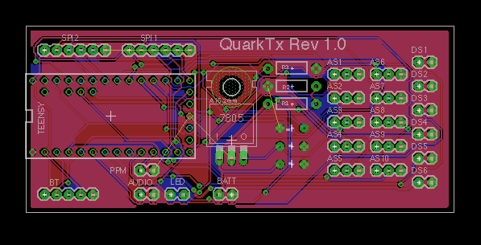
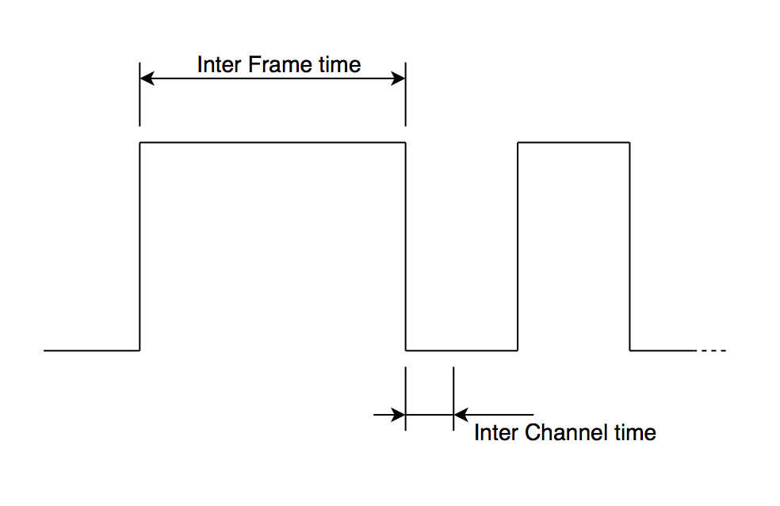
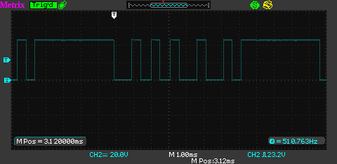
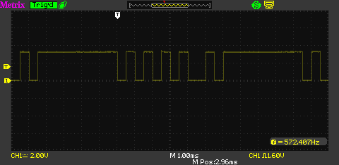
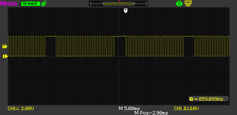

# Radio user guide

## First compilation

You should first install the Arduino software (IDE) from the official Arduino site <http://www.arduino.cc> in download section. Then, get a copy of QuarkTx source code from <https://github.com/hexabyte23/QuarkTx> by using `Download ZIP` button or by using [GitHub desktop](https://desktop.github.com).

Once the source code is put in your local PC/Mac, doubleclick on Radio/Radio.ino file. Arduino software will automatically be opened, and Radio.ino source file displayed.

>For **Arduino Nano** platform
>
>Before compiling code, you must first select **Arduino Nano** in the Tools/Board type menu. 

or
  
>For **Teensy 3.2** platform
>
>Before compiling code, you must first install [Teensyduino](https://www.pjrc.com/teensy/teensyduino.html), then select **Teensy 3.2/3.1** in the Tools/Board type menu. 
>
>Then you must install [Lua core functions](https://github.com/hexabyte23/QuarkTx/blob/master/Lua/README.md) to Arduino library path

You can then plug your device to your local PC/Mac with USB connector, and hit `upload` button from Arduino IDE.

## First start

Open Serial Monitor from Arduino IDE. The booting sequence messages should be as below:

	Quark Tx v0.2.0
	Teensy 3.2 platform
	Booting...
	Serial		OK
	Command		OK
	e-edic
	Tx		OK
	Ready
	>

The line started with **e-** is an error raised during booting sequence. (See [Error messages](#error-messages) pane for errors detail).

This specific '**e-edic**' error can occurs in 2 cases : You really have an EEPROM data corruption problem or this is the first time ever you start QuartTx. To clean this error you must calibrate all sensors connected, then save the result.
 

### Calibration

#### Gimbal & switches calibration
Sensors calibration would setup limits of all sensors curses. to do so, make sure first that all sensors are connected to the board (as describe at [electric diagram](#Arduino-Nano-schema)), then execute toggle command `c`. This command make you enter in the calibration mode. You must execute `c` command again to exit from this mode.

In calibration mode you will see real time data moving as:

	{381	627}	{393	631}	{389	635}	{385	627}	{0	1}	{0	1}	{0	1}	
	{381	627}	{393	631}	{389	635}	{385	627}	{0	1}	{0	1}	{0	1}	
	{381	627}	{393	631}	{389	635}	{385	627}	{0	1}	{0	1}	{0	1}	

Each pair of numeric data inside {} are the minimal and the maximum limit value (range 0 to 1023) for a given sensor. In that example, sensor 0 minimum limit is 381 and maximum is 627, sensor 1 minimum limit is 393 and maximum is 631, and so on ... 

To calibrate sensors, you must move all sensors physically from their minimum curse to their maximum curse until min/max of each sensors become stable to a unique value. (do not forget mechanical trims on old gimbals and mechanical switches).

***Warning***: Make sure to reach sensor real limits to prevent
 any limit boundary overflow during your fligth that should cause a crash !

When its done, you can exit calibrate mode (`c`). 

Its now time to save to EEPROM your settings by executing `v` command. You can check if that operation succeed by hiting the hardware reset button on the board. The **e-edic** error is now supposed to disappear during booting sequence otherwise you have a real EEPROM data corruption problem.

You can now use one of the commands available (check [Commands](#commands) for details) or use Gui app (still in dev) for Win 10/OSX/Android or IOS.

#### Battery level calibration

Depending of [R1 & R2 resistors](# Arduino Nano schema) quality (5% or less), you must calibrate Battery sensor.

As you may see when you send dump sensors command `d s`, there a special sensor at the end of the list with a ***b*** pin ID

	Dump
	Sensors (6)
	# Pin   Trim    Min     Max
	0 14	0	0	1023
	1 15	0	0	1023
	2 16	0	0	1023
	3 17	0	0	1023
	4 2	0	1	1
	5 3	0	1	1
	b 21	55	0	1023

This sensor measure de battery level and must be calibrate to make sure that radio will raise a error signal at the rigth voltage level if battery goes down `BATTERY_RAISE_ALARM_LEVEL` (check [Configuration](#Configuration))

To do so you must plug a voltmeter between Vcc and GND of your battery connector, then send `i` toggle command to display the voltage level (last colomn), then fine tune the trim xx value by sending as many command `s t b xx` as needed to match the voltmeter value with the last column value.

The best approach is to make this calibration a little bit upper `BATTERY_RAISE_ALARM_LEVEL` you setup by using a stab power supply. 

***Warning***:: Do not forget to save to EPPROM once calibration step seems ok for you.

Have fun.

## Audio settings
For Teensy 3.2 only

To be define

## Commands

All commands in QuarkTx are only one character long.

Command | Sub command | Description
----------|------------|------
a||Load settings (calibration, curses, RCL scripts) from EEPROM
c||Toggle sensors calibration mode
d||Dump all (Sensor, Model, EEPROM, RCL Script)
d|m|Dump only model
d|e|Dump only EEPROM
d|s|Dump only sensors
d|l|Dump only RCL scripts
f||Get free memory (in byte)
h||Display commands list
i|[freq]| Toggle input sensor update
l|idx| Load from EEPROM to current model
m||Toggle Tx mode (transmit or debug)
n||Display version
o||[freq]| Toggle output PPM update
r||Reset all (Sensor, Model, RCL script)
r|m|Reset only model
r|s|Reset only sensors
r|l|Reset only RCL script
s|a chan val| Set current model servo max
s|i chan val| Set current model servo min
s|l chan rclStr| Set RCL code to PPM chan
s|n chan val| Set current model servo neutral
s|r chan val| Set current model servo revert
s|t sensorID val| Set sensor trim
s|u sensorID val| Set simulate value
s|v sensorID val| Set sensor Min
s|w sensorID val| Set sensor Max
u|| Get UUID (only for Teensy platform)
v||Save to EEPROM

## Error messages
All serial message starting with **e-** is an error message code. It's not directly human readable but have a very short printfoot in memory (For Arduino board).

Error msg | Short description| Long description
----------|------------------|-----------------
e-bp | Bad parameter | You are using a bad parameter in the current command
e-bpim | Bad parameter: index is missing |
e-edic | EEPROM data is corrupted | Error during EEPROM read
e-pf | RCL parsing failed | Usually syntax error in RCL formula
e-bcf | Bad command format | No space found between first command letter and following parameters
e-cu | Command unknown | Check [Commands](#commands) list
e-nt | None type | Bad RCL nodes initialization
e-cstl | Command string too long | Your command line is greater than `MAX_SERIAL_INPUT_BUFFER`
e-btl | Battery level too low| Your battery voltage level is lower than  `BATTERY_RAISE_ALARM_LEVEL`
e-ni| Not implemented |

## Hardware

### RC Box
To be define

### Arduino Nano schema

### Teensy 3.2 schema

### Arduino board
To be define

### Teensy 3.2 board

### Sensors
Sensors are all physical device (Gimbal, switch, button) that you can add in QuarkTx board.

#### Gimbal
To be define

#### Switch
To be define

## RF module
QuarkTx is able to generate PPM signal for different type of RF module.

### Tested modules

Company | Name | # channels | Inter frame | Inter channel
--------|------|------------|-------------|--------------
Jeti | TU2 2.4 Ghz | tested, up to 17 | 4500 | 1500
FrSky | DHT 8ch DIY | tested, up to 4 | 4500 | 1500 

### Output PPM signal
To fine tune PPM signal, depending of the RF module you use, you can modify the 2 constants below (config.h):

* `PPM_INTER_CHANNEL_TIME` 
* `PPM_INTER_FRAME_TIME`

Exemple of Arduino scope screen copy with 4 gimbals/3 switches/6 channels hardware config

Exemple of Teensy scope screen copy with 4 gimbals/3 switches/6 channels hardware config

Exemple of Teensy scope screen copy with 4 gimbals/3 switches/24 channels hardware config

## Bluetooth
QuartTx support HC-06 electronic module below:

Brand name| Voltage|QuartTx type
----------|--------|---------------
Itead studio| 3.3 V DC| Teensy 3.2 board

## Configuration
All constant parameters is group in a single config.h file.

Name | Description| Default
--------|---------|--------
`QUARKTX_SERIAL_SPEED`| Serial speed for USB console or BT|9600
`MAX_MODEL`| Max number of models store in EEPROM|2
`MAX_SERIAL_INPUT_BUFFER`| to be define
`ADC_MIN_VALUE`| Sensors value|0
`ADC_MAX_VALUE`| Sensors value|1023
`PPM_MIN_VALUE`| See [Output PPM signal](#output-ppm-signal)|500 usec
`PPM_MAX_VALUE`| See [Output PPM signal](#output-ppm-signal)|1500 usec
`TRIM_MIN_VALUE`| to be define
`TRIM_MAX_VALUE`| to be define
`TX_MODE`| to be define
`LED_BLINK_PERIOD`| to be define
`BATTERY_RATE_UPDATE`| to be define
`BATTERY_HISTO_BUFFER_SIZE`| to be define
`BATTERY_R1`| to be define
`BATTERY_R2`| to be define
`BATTERY_RAISE_ALARM_LEVEL`| Battery min voltage level|Depend of your batt pack(S1, S2..)

## Radio Control Language
For Arduino Nano & Teensy 3.2 platform

This new script language has been designed to be able to describe all dependencies between input sensors and PPM output channels. To simplify dependency graph, there is only one script per PPM output channel. Every script is evaluated in real time. Up to 300 update/sec on Arduino Nano board and up to 900 update/sec on Teensy 3.2 board clocked to 96 MHz for a simple script.

_Exemple_: `s l chan rclStr` will modify the current RCL script of a given output PPM channel `chan`  with the new script string `rclStr`. A script could not be longer than **`MAX_SERIAL_INPUT_BUFFER`** characters (config.h)

***Warning***: No white space is allowed between identifier/operator/modifier.

### Sensor variable
A sensor variable is define by a single character `i` followed by the sensor index (with index range [O, **`MAX_INPUT_CHANNEL `**]). For exemple `i2` is used for the _third_ sensor, as index started from 0.

By default, the minimal script below is present on every PPM channels during the first booting sequence:  `i*x*` (with x range [0, **`MAX_INPUT_CHANNEL`**]). This is the smalest script you can write to associate one single input sensor to an output channel.

Every time you use reset command `r`, this minimal script will be set on all channels.

The sensor output range of value is [0, 1023].

_Exemple_: `s l 1 i3`. This command will associate sensor 3 values with PPM output 1 values in real time.

### Constant expression
Constant types are : Integer (ex: 1023), float (ex: 0.123), boolean (ex: T or F)

_Exemple1_: `s l 3 10+i2*1.3`

_Exemple2_: `s l 1 F?i1:i2`

### Basic arithmetic operator

Operator:

*expression1***`+`***expression2*

*expression1***`-`***expession2*

*expression1***`*`***expression2*

*expression1***`/`***expression2*

_Exemple_: `s l 0 (i3+1)/3.3-22`

### Sub expression
Command:

**(** sub expression**)**

_Exemple_:  `s l 0 10+(i2/3.3)`

### Dual rate function
Operator [] is used to modify the output range of a sensor variable or a sub expression.

_Exemple 1_: `s l 0 i1[20;30]`. This will reduce the sensor 1 range from [0, 1023] to [20, 30].

_Exemple2_: `s l 0 (i1+10)[100;500]`. More complex script to reduce the range of a sub expression result.

### Reverse function
Operator [] is used to reverse the output range of a sensor variable or a sub expression.

_Exemple_: `s l 0 i1[1023;0]`. This will change the output value of sensor 1 range from [0, 1023] to [1023, 0], so the signal will be reversed.

### Exponential function
To be define

### Mixer function
To be define

### IF function

Command: *expression***?***action1***:***action2*

_Exemple_: `(i1>512)?i2:i2[1023:0]` will return i2 until i1 < 512 then reverse i2

## Lua scripts

For Teensy 3.2 platform only

To be define